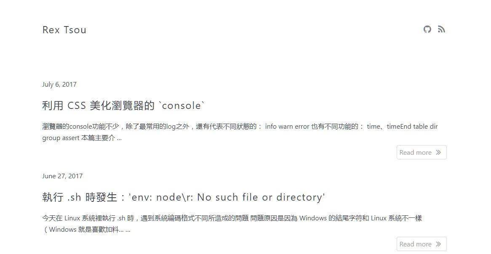

# Clean

A clean blog theme for hugo.



## Getting Started

Clone this repository to your hugo theme directory.

```
mkdir themes
cd themes
git clone https://github.com/akccakcctw/clean.git
```

## Build

```
hugo server
```

You can go to localhost:1313 and this theme should be visible.

## License

Clean is licensed under the [MIT License](LICENSE.md).

## Author

[Rex Tsou](https://github.com/akccakcctw)
